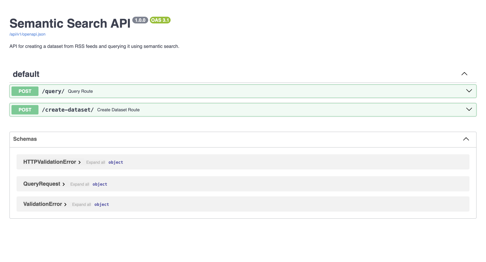

# Gossip Search Application

## Overview

Gossip Search is a full-stack web application that leverages semantic search to retrieve relevant articles from various RSS feeds. The backend is built with FastAPI and uses advanced NLP models to embed and search articles based on user queries. The frontend is developed using React and provides an intuitive interface for users to search and browse articles.

## Features

- **Semantic Search**: Utilizes state-of-the-art NLP models to provide relevant search results.
- **Real-time Updates**: Articles are fetched and embedded in real-time from multiple RSS feeds.
- **User-friendly Interface**: A clean and responsive UI built with React and Tailwind CSS.
- **API Documentation**: Interactive API documentation powered by Swagger UI.

## Screenshots

Screenshot of the Gossip Search website.  


Screenshot of the Swagger UI for API documentation.  


## Tech Stack

### Backend

- **FastAPI**: A modern, fast (high-performance) web framework for building APIs with Python.
- **Uvicorn**: An ASGI server for serving FastAPI applications.
- **Sentence Transformers (`msmarco-distilbert-dot-v5`)**:
  - **Model**: `msmarco-distilbert-dot-v5` is a state-of-the-art NLP model fine-tuned on the MS MARCO dataset, which consists of real user search queries.
  - **Functioning**: This model is designed for semantic search tasks, where it embeds both queries and documents into a high-dimensional vector space. The similarity between these embeddings is then computed using the dot product, which measures how closely related the query is to each document. This approach allows the model to capture the semantic meaning of the text, providing more relevant search results compared to traditional keyword-based searches.
  - **Use Case**: Ideal for applications requiring efficient and accurate information retrieval, such as search engines, question-answering systems, and recommendation systems.
- **Docker**: Containerization for consistent deployment across environments.

### Frontend

- **React**: A JavaScript library for building user interfaces.
- **Tailwind CSS**: A utility-first CSS framework for rapid UI development.
- **Docker**: Containerization for consistent deployment across environments.

## Getting Started

### Prerequisites

- Docker and Docker Compose installed on your machine.

### Running the Application

1. **Clone the Repository**:
   ```bash
   git clone <repository-url>
   cd gossip-search
   ```
   
2. **Build and Run Containers**:
   ```bash
   docker-compose up --build
   ```

3. **Access the Application**
- **Frontend**: Open your browser and navigate to `http://localhost:3000`.
- **Backend (Swagger UI)**: Navigate to `http://localhost:5050/docs` for API documentation.

## Project Structure

### Backend

- **`main.py`**: Entry point for the FastAPI application.
- **`dataset.py`**: Functions for creating and managing the dataset of articles.
- **`query.py`**: Functions for querying the dataset using semantic search.
- **`utils.py`**: Utility functions for text sanitization and chunking.
- **`models.py`**: Pydantic models for request validation.

### Frontend

- **`App.tsx`**: Main component rendering the search bar and articles list.
- **`ArticlesList.tsx`**: Component for displaying the list of articles.
- **`SearchBar.tsx`**: Component for the search bar to input queries.
- **`context.tsx`**: Context provider for managing global state.
